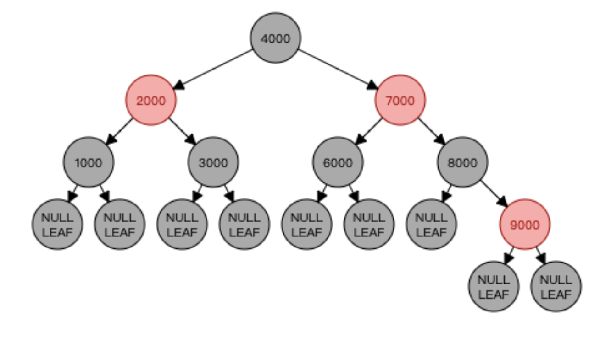

# 红黑树

红黑树，Red-Black Tree 「RBT」是一个自平衡(不是绝对的平衡)的二叉查找树(BST)。

红黑树是在1972年由Rudolf Bayer发明的，当时被称为平衡二叉B树（symmetric binary B-trees）。后来，在1978年被 Leo J. Guibas 和 Robert Sedgewick 修改为如今的“红黑树”。

红黑树是一种特化的AVL树（平衡二叉树），都是在进行插入和删除操作时通过特定操作保持二叉查找树的平衡，从而获得较高的查找性能。

## 红黑树的性质
1. 每个节点要么是红色，要么是黑色。
2. 根节点永远是黑色
3. 每个叶子节点（NIL）是黑色
4. 每个红色节点的子节点一定是黑色节点
5. 任意一节点到每个叶子节点的路径都包含了相同数量的黑色节点（保证树尽量是平衡的）