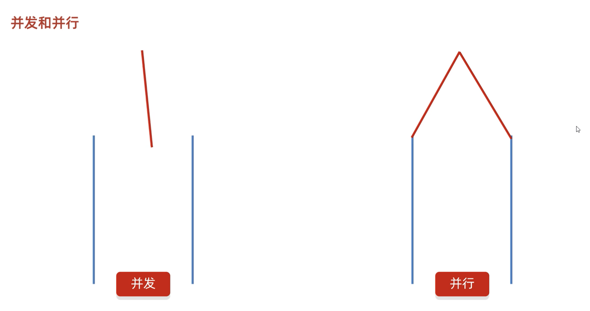

# Java 多线程编程
1. [为什么要有多线程](#什么是线程)
2. [多线程的实现方式](#threadrun-和-start-的区别)
3. [常见的成员方法]()
4. 线程安全问题
5. 死锁
6. 生产者和消费者


## 什么是线程
线程是操作系统能够进行运算调度的最小单位，它被包含*进程*之中，是进程中的实际运作单位
1. 什么是多线程？*可以让程序同时做多件事*
2. 好处？*提升效率*

## 并发和并行
并发：在同一时刻，有多个指令在单个 CPU 上交替运行
并行：在同一时刻，有多个指令在多个 CPU 上同时进行



## Thread.run() 和 start() 的区别
当你调用 run 方法时，实际上是在当前线程中运行 run 方法的逻辑，而不会创建新的线程。这样做不会实现多线程的并发执行，而只是按照顺序在当前线程中执行 run 方法的内容。

而当你调用 start 方法时，start 方法会创建一个新的线程，并在新的线程中执行 run 方法的逻辑。这样就实现了多线程的并发执行。start 方法负责启动新线程，使其处于就绪（Runnable）状态，然后在合适的时机由操作系统调度执行。

所以，调用 run 方法只是在当前线程中执行相应的逻辑，而调用 start 方法才是创建新线程并在新线程中执行 run 方法的方式。

## 多线程的实现方式
1. 继承 Thread类的方式进行实现
2. 实现 Runnable 接口的方式进行实现
3. 利用 Callable 接口和 Future 接口方式实现


```java
/**
 *  T 代表泛型，需要记录多线程运行完什么样类型的结果
 * **/

public class MyCallable implements Callable<T> {
    @Override
    public T call() throws Exception {
        return null;
    }
}

```

